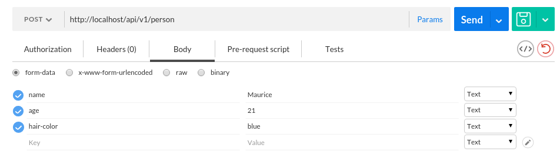

Poniższy tekst jest częścią pracy dyplomowej Adriana Wydmańskiego. 

Uniwersytet Adama Mickiewicz w Poznaniu
Wydział Matematyki i Informatyki.
Promotor: prof. dr hab. Marek Nawrocki

##Table of contents

1. [Getting started](https://github.com/Sealious/sealious-handbook#getting-started)
2. [Sample Sealious app](https://github.com/Sealious/sealious-handbook#simple-sealious-app)
    * [Declaring our first ResourceType](https://github.com/Sealious/sealious-handbook#declaring-our-first-resourcetype)
    * [Adding more resources](https://github.com/Sealious/sealious-handbook#adding-more-resources)
    * [Final result](https://github.com/Sealious/sealious-handbook#final-result)
3. [Base chips](https://github.com/Sealious/sealious-handbook#sealious-base-chips)
    * [Access Strategy](https://github.com/Sealious/sealious-handbook#access-strategy)
        * [What is an access strategy](https://github.com/Sealious/sealious-handbook#i-what-is-an-access-strategy)
        * [How to use access strategies](https://github.com/Sealious/sealious-handbook#ii-how-to-use-access-strategies)
        * [Access strategies in Sealious](https://github.com/Sealious/sealious-handbook#iii-access-strategies-in-sealious)
        * [Creating a new access strategy](https://github.com/Sealious/sealious-handbook#iv-creating-a-new-access-strategy)
        * [Common questions and errors](https://github.com/Sealious/sealious-handbook#v-common-questions-and-errors)
    * [Field Types](https://github.com/Sealious/sealious-handbook#field-types)
        * [What are field types](https://github.com/Sealious/sealious-handbook#i-what-are-field-types)
        * [How to use field types](https://github.com/Sealious/sealious-handbook#ii-how-to-use-field-types)
        * [Field types in Sealious](https://github.com/Sealious/sealious-handbook#iii-field-types-in-sealious)
        * [Creating a new field type](https://github.com/Sealious/sealious-handbook#iv-creating-a-new-field-type)
        * [Common questions and errors](https://github.com/Sealious/sealious-handbook#v-common-questions-and-errors-1)

## Getting started
*Before starting your journey with Sealious, make sure [Node.js](https://nodejs.org/en/) is installed and set. Also we'll be using [MongoDB](https://www.mongodb.org/) in our examples.*

1. Open command line in your desired directory.
2. Type in `npm init`. This is create `package.json` file, which will hold all crucial data about your project.
    * You will be prompted several times, you can just `ENTER` through.
3. Once `package.json` is set, type in `npm install --save sealious`. This will download Sealious from `npm` (Node Package Manager) and save the dependency in your `package.json`.
4. We need to have some means of communication with the server. Type in `npm install --save sealious-www-server` and `npm install --save sealious-channel-rest`.
5. To set the database, type in `npm install --save sealious-datastore-mongo`.

And that's it. Note that Sealious reads its dependencies from `package.json`, so don't forget to create it.


## Simple Sealious app
In this section we will show you how to create a fully functional and working back-end application, with REST routes and database handling set, in just **28** lines:

```js
1   var Sealious = require("sealious"); 
2
3   Sealious.init();
4
5   require("./field-type.animal.js");
6
7   new Sealious.ChipTypes.ResourceType({
8       name: "owner",
9       fields: [
10          {name: "first-name", type: "text", required: true},
11          {name: "last-name", type: "text", required: true},
12          {name: "address", type: "text", required: true},
13          {name: "phone-number", type: "int", required: true}
14          {name: "email", type: "email"}
15      ]
16  });
17
18  new Sealious.ChipTypes.ResourceType({
19      name: "pet",
20      fields: [
21          {name: "species", type: "animald", required: true},
22          {name: "name", type: "text", required: true},
23          {name: "age", type: "int", required: true},
24          {name: "diagnosis", type: "text", params: {max_length: 200}, required: true}
25     ]
26  });
27
28  Sealious.start();
```

We'll call this project **Veterinarian Clinic**. Basically it's main task is to store information about pets and their owners.


### Declaring our first ResourceType

ResourceType is the core concept of Sealious. Without it, Sealious has nothing to work on.

Let's create a new resource named `owner`.

In the real world, a pet must have a name and some age. Here's how we'll represent it in Sealious:

```js
1   var Sealious = require("sealious"); 
2
3   Sealious.init();
4
5   new Sealious.ChipTypes.ResourceType({
6       name: "owner",
7       fields: [
8           {name: "first-name", type: "text", required: true},
9           {name: "last-name", type: "text", required: true},
10          {name: "address", type: "text", required: true},
11          {name: "phone-number", type: "int", required: true}
12          {name: "email", type: "email"}
13      ]
14  });
15
16  Sealious.start();
```

This app consists of four parts:

 * `var Sealious = require("sealious");` - a reference to Sealious,
 * `Sealious.init();` - loads Sealious components,
 * `new Sealious.ChipTypes.ResourceType({})` - defines a new resource-type that will be our data model,
 * `Sealious.start();` - prepares REST routes, sets the database, loads dependencies - gets the whole thing started.

This is all we need to start a new Sealious app.

From now on we can communicate with the server through REST routes (the default Sealious channel):

 * `GET` on URL `api/v1/owner` returns all `owner` resources,
 * `GET` on URL `api/v1/owner/{owner_id}` returns a specific `owner` resource,
 * `POST` on URL `api/v1/owner` with body `{name: <text>, age: <int>}` creates a new `owner` resource with given body,
 * `PUT` and `PATCH` on URL `api/v1/owner/{owner_id}` with body `{name: <text>, age: <int>}` modifies the `owner` resource,
 * `DELETE` on URL `api/v1/owner/{owner_id}` deletes a specific `owner` resource.


---

**Q**: *How can I communicate with the server if I don't want to use REST?*

**A**: We give the developers channel REST by default. If you want to use other channel you are free to write one yourself. See X for more information.

---

**Q**: *I have no idea what's happening in this ResourceType thing...*

**A**: Let's walk through it step by step:

1. `new Sealious.ChipTypes.ResourceType({` - this line creates a new `ResourceType` object, that will enable you to work on your resources.
2. `name: "owner",` - this is the name of our resource, that we can work with.
3. `fields: [` - we define `fields` array that holds information about what type of data our resource can store.
4. `{name: "first-name", type: "text", required: true},` - this is the field used by our resource. The name of the field is `name`, its type is `text` and it must be delcared (`required: true`).
5. `{name: "last-name", type: "int", required: true}` - this is the another field used by our resource. The name of the fields is `age`, its type is `int` and it must be declared (`required: true`).
6. `{name: "email", type: "email"}` - this defines the field named `email` with type `email` - it only accepts strings that look like and email. Note that `required: true` is absent - that means, that you don't have to include this field and the request will still be parsed correctly.

And that's it.

If you want to know more about `ResourceType`, see X.

If you want to know more about `FieldType`, see X.

### Adding more resources

You can add as many resources as you need. In our example, we'll add `pet` resource.

```js
1   var Sealious = require("sealious"); 
2
3   Sealious.init();
4
5   new Sealious.ChipTypes.ResourceType({
6       name: "owner",
7       fields: [
8           {name: "first-name", type: "text", required: true},
9           {name: "last-name", type: "text", required: true},
10          {name: "address", type: "text", required: true},
11          {name: "phone-number", type: "int", required: true}
12          {name: "email", type: "email"}
13      ]
14  });
15
16  new Sealious.ChipTypes.ResourceType({
17      name: "pet",
18      fields: [
19          {name: "species", type: "text", required: true},
20          {name: "name", type: "text", required: true},
21          {name: "age", type: "int", required: true},
22          {name: "diagnosis", type: "text", params: {max_length: 200}, required: true}
22      ]
23  });
24
25  Sealious.start();
```

As you can see, the `pet` resource has *four* fields:

1. `spieces`,
2. `name`,
3. `age`,
4. `diagnosis`.

The new thing here is `params: {max_length: 200}` in field `diagnosis`. This parameter says, that only strings with length up to 200 characters.

And that's it. We've finished our **Veterinarian Clinic**!

---

**Q**: *But wait, the first code block you showed us had line `require("./field-type.animal.js");`. What's with this?*

**A**: Nice eye. Here's the explanation:

Sealious let's you define your own field-types, that will validate, encode or decode (and many more - see API reference) the values that's in the field.

For our example, we've defined a new field-type, that checks if given animal species is acceptable by our clinic:

```js
1   var Sealious = require("sealious");
2
3   new Sealious.ChipTypes.FieldType({
4       name: "animal",
5       get_description: function(context, params){
6           return "Only accepts dogs, cats and parrots.";
7       },
8       is_proper_value: function(accept, reject, context, params, new_value){
9           var acceptable_animals = ['dog', 'cat', 'parrot'];
10          var result = acceptable_animals.find( x => x === new_value);
11
12          result ? accept() : reject("This species of animal is not accepted");
13      }
14  });
```

If you want to know more about `FieldType`, see X.

Now if we include our newly created field-type, we can check what's the spieces of the pet we want to add to our resources.


### Final result:
```js
1   var Sealious = require("sealious"); 
2
3   Sealious.init();
4
5   require("./field-type.animal.js");
6
7   new Sealious.ChipTypes.ResourceType({
8       name: "owner",
9       fields: [
10          {name: "first-name", type: "text", required: true},
11          {name: "last-name", type: "text", required: true},
12          {name: "address", type: "text", required: true},
13          {name: "phone-number", type: "int", required: true}
14          {name: "email", type: "email"}
15      ]
16  });
17
18  new Sealious.ChipTypes.ResourceType({
19      name: "pet",
20      fields: [
21          {name: "species", type: "animald", required: true},
22          {name: "name", type: "text", required: true},
23          {name: "age", type: "int", required: true},
24          {name: "diagnosis", type: "text", params: {max_length: 200}, required: true}
25     ]
26  });
27
28  Sealious.start();
```


## Sealious base chips

### Access Strategy

#### I. What is an access strategy?
Access strategy is a function that takes a context as an argument and based on it either allows or denies access to certain resources or operations.

#### II. How to use access strategies
One of the possible ways to use an access strategy is when defining a new `resource`.

```js
    new Sealious.ResourceType({
        name: "nobody_can_update_me",
        fields: [{  name: "value", type: "text" }],
        access_strategy: {
            update: "noone"
        }
    });
```

In this example we use Access Strategy `noone` that rejects any `update` request.

#### III. Access strategies in Sealious
Sealious comes with *three* pre-defined access strategies. that are located in `lib/base_chips`.
File `lib/base-chips/_base-chips.js` defines the order of access strategies initilizing.

1. Just owner:
    * only the owner of the resource can modify it
2. Noone:
    * noone can modify the resource
3. Public:
    * Everybody has access to the resource.


#### IV. Creating a new access strategy

#### V. Common questions and errors

### Field-Types

#### I. What are field types?
Each "field" in a ResourceType must have a field-type assigned. Field-types describe which values can and which cannot be assigned to a field. Field-type's behaviour can be adjusted using field-type parameters.

A field-type can accept or reject a value, with appropriate error message.

It's a field-type's responsibility to describe how to store it's values in a datatore.

#### II. How to use field types?
The example below shows a simple Sealious app:
```js
1   var Sealious = require("sealious");
2  
3   Sealious.init();
4 
5   new Sealious.ChipTypes.ResourceType({
6      name: "person",
7      fields: [
8          {name: "name", type: "text", params: {max_length: 25}, required: true},
9          {name: "age", type: "int", required: true},
10         {name: "hair-color", type: "color"}
11     ]
12  });
13
14  Sealious.ChipManager.get_chip("channel", "rest").set_url_base("/api/v1");
15
16  Sealious.start();
```

Several things to note:

1. There are *three* fields declared:
    * `name`, which is of `text` type,
    * `age`, which is of `int` type,
    * `hair-color`, which is of `color` type.

2. Each field-type describes how the field behaves and what value it contains. 
For example, `field-type.color` accepts values like:
    * `"black"`, 
    * `"#000000"`, 
    * `{r: 0, g: 0, b: 0}`,
    but rejects values such as `"this is my color"`.

3. Field `name` has defined an object called `params`, which provides additional information about the field-type. 
In this case, `name` can have no more than `25` characters.
Every field can have `params` object to specify what values can be accepted and what rejected.

---

**Q**: *But how can I actually use those field-types?*

**A**: Good question.

Sealious uses channel REST by default. You can send HTTP request on URL `http://localhost/api/v1/<resource_name>`. In our case, `<resource_name>` is `person`.

This means that you can send, for example, HTTP POST request on URL `http://localhost/api/v1/person` with body:

 * `name: Maurice`,
 * `age: 21`,
 * `hair-color: blue`,

because of the fields defined in our app.



Sending this request will result in adding a new user named **Maurice**, who is **21** years old and has **blue** hair color to the database.

#### III. Field types in Sealious
Sealious comes with *eleven* pre-defined field-types. that are located in `lib/base_chips`.
File `lib/base-chips/_base-chips.js` defines the order of field-type initilizing.

1. Boolean 
    * boolean value: `true` or `false`,
    * can be a string: `"true"` or `"false"`, 
    * as well as numeric: `1` or `0`. 
2. Color
    * `"black"`, 
    * `"#000000"`, 
    * `{r: 0, g: 0, b: 0}`. 
3. Date
    * date standard ISO 8601 `YYYY-MM-DD`,
    * rejects other date formats.
4. Datetime
    * timestamp - amount of miliseconds since epoch.
5. Email
    * email address, like something@something.sth.
6. File
7. Float
    * a float number.
8. Hashed-text
    * hash with chosen algorithm (default `md5`),
    * designed to hash passwords:
        * can specify 1 or more required numbers,
        * can specify 1 or more required capital letters,
        * can specify 1 or more required numbers and capital letters.
9. Int
    * an integer number.
10. Reference
11. Text
    * can specify maximum string length,
    * can specify minimum string length.

#### IV. Creating a new field type
In this section we will show you step by step how to create your own field-type.
We will use `field-type.color` for this example.

1. Create your field-type file in `lib/base-chips/`.
2. Add reference to `lib/base-chips/_base-chips.js`:
    ```js
    // some requires...
    require("./field_type.color.js"); //add this
    require("./field_type.file.js");
    // some requires...
    ```

3. Write the skeleton of your new field-type.
    ```js
    1   var Sealious = require("sealious");
    2
    3   new Sealious.ChipTypes.FieldType({
    4        
    5   });
    ```

4. The most basic form of field-type consists of `name` property and `is_proper_value` method. Let's add them!
    ```js
    1   var Sealious = require("sealious");
    2
    3   new Sealious.ChipTypes.FieldType({
    4       name: "color", // important! This is the name of your field-type
    5       is_proper_value: function(accept, reject, context, params, new_value){ 
    6           // checks if `new_value` is correct. If not, it rejects the request.
    7       }
    8   });
    ```
*Note*: `is_proper_value` method checks if `new_value` is correct. If not, it rejects the request.

5. Since we want to create a field-type that will accept colors, we have to implement `is_proper_value` method properly, so that it will accepts values like `"black"` or `"#123FA5"` and reject values like `"silly sealy"`.
In this example we will use a module from `npm` called `color`.
    ```js
    1   var Sealious = require("sealious");
    2   var Color = require("color");
    3
    4   new Sealious.ChipTypes.FieldType({
    5       name: "color", // important! This is the name of your field-type
    6       is_proper_value: function(accept, reject, context, params, new_value){
    7          // checks if `new_value` is correct. If not, it rejects the request.
    8           try {
    9               if (typeof (new_value) === "string")
    10                   Color(new_value.toLowerCase());
    11              else
    12                  Color(new_value);
    13          } catch (e){
    14              reject("Value `" + new_value + "` could not be parsed as a color.");
    15          }
    16          accept();
    17      },
    18  });
    ```
And now, `is_proper_value` will accept those colors, that can be parsed correctly by `color` module. If the parsing cannot be done, the method will reject the `new_value` argument.

6. Voila! We have created a new field-type that accepts colors! 

---

**Q**: *Is it all?*

**A**: Yes, this is how you create a new field-type. But there **can** be more to it.

Let's say, that we want to store some colors in the database. This may be troublesome, because of several ways to define a color:

* `black` (explicitly), 
* `{r: 10, g: 2, b: 200}` (RGB object),
* `"#115DFA"` (hex value).


So the safer approach would be parsing the colors to one, standarized form. 

This is what `encode` ensures - it transforms (or encodes) the value that was given to `is_proper_value` to what we want. 

```js
1   var Sealious = require("sealious");
2   var Color = require("color");
3
4   new Sealious.ChipTypes.FieldType({
5       name: "color", // important! This is the name of your field-type
6       is_proper_value: function(accept, reject, context, params, new_value){
7            // checks if `new_value` is correct. If not, it rejects the request.
8           try {
9               if (typeof (new_value) === "string")
10                  Color(new_value.toLowerCase());
11              else
12                  Color(new_value);
13          } catch (e){
14              reject("Value `" + new_value + "` could not be parsed as a color.");
15          }
16          accept();
17      },
18      encode: function(context, params, value_in_code){
19          var color = Color(value_in_code);
20          return color.hexString();
21      }
22  });
```
And that's it. Now you can use `color` as a field-type in your app field delcaration.


#### V. Common questions and errors

**Q**: *I created a new field-type and I want to use it in my app. But when I create a new field with my field-type and start the app, I get this error:*
```js
Error: In declaration of resource type 'person': unknown field type 'my-new-field-type' in field 'name'.

```

**A**: There are several causes that may throw this error (**not** including typos):

1. Did you remember to add your new field-type reference to `/lib/base-chips/_base-chips.js`? 
    ```js
    // some requires
    require("./field_type.color.js");
    require("./field_type.file.js");
    require("./your-new-field-type.js") // your field-type
    // some requires
    ```

2. Did you remember to include `name` property in your field-type declaration?
    ```js
    new Sealious.ChipTypes.FieldType({
        name: "my-new-field-type", // important! This is the name of your field-type
        //rest of the declaration
    });
    ```


---


**Q**: *I used my new field-type in my app declaration, everything is okay when the app starts, but when I try to use HTTP POST request, nothing happens. No error, no response, nothing.*

**A**: Make sure that in your field-type declaration, the `is_proper_value` method uses `accept()` argument.
```js
is_proper_value: function(accept, reject, context, params, number){
    // checks if `new_value` correct. If not, it rejects the request.
    var test = parseFloat(number);
    if (test === null || test === NaN || isNaN(number) === true) {
        reject("Value `" + number + "` is not a float number format.");
    } else {
        accept(); // remember to add this
    }
}
```


---


**Q**: *I try to create a new field-type that inherits (extends) from an already-existing field-type. I added the reference to `/lib/base-chips/_base-chips.js`, but all I get is this error:*
```
Error: ChipManager was asked to return a chip of type `field_type` and name `<already-existing-field-type>`, but it was not found
```

**A**: File `/lib/base-chips/_base-chips.js` contains a list of currently used field-types. Those field-types are loaded one after another, sequentially. This error occurs, when you want to load your field-type **before** the already existing field-type you want to inherit from.

Make sure that Sealious **first** loads that existing field-type, and **then** yours:
```js
// some requires
require("./already-existing-field-type.js") // this is above your field-type
require("./your-field-type.js"); // this is your field-type
// some requires
```